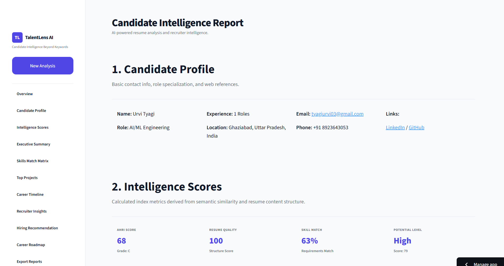

<div align="center">

# TalentLens AI

### AI-Powered Resume Intelligence & Candidate Screening Platform

Analyze resumes beyond keyword matching using NLP, semantic similarity, skill intelligence, and recruiter-focused insights.


</div>

---

# Overview

TalentLens AI is an intelligent resume analysis platform that helps recruiters evaluate candidates beyond traditional keyword matching.

Instead of simply counting matching keywords, TalentLens AI analyzes resume quality, semantic similarity with job descriptions, skill intelligence, candidate potential, hiring recommendations, and career growth insights.

The project demonstrates practical applications of:

- Natural Language Processing
- Machine Learning
- Information Retrieval
- Resume Parsing
- Semantic Search
- Recruiter Intelligence
- Streamlit Dashboard Development

---

# Features

## Candidate Intelligence

- Resume Parsing
- Job Description Parsing
- Candidate Profile Extraction
- Contact Information Detection
- Experience Extraction
- Education Extraction
- Skills Detection

---

## AI Intelligence Scores

TalentLens generates multiple recruiter-friendly scores including:

- AHRI Score
- Resume Quality Score
- Skill Match Percentage
- Candidate Potential Score
- Hiring Recommendation
- Semantic Similarity Score

---

## Recruiter Insights

The platform automatically generates:

- Executive Summary
- Candidate Strengths
- Missing Skills
- Hiring Recommendation
- Risk Factors
- Interview Focus Areas

---

## Skill Intelligence

- Skill Match Matrix
- Required Skills
- Missing Skills
- Additional Skills
- Technical Skills
- Soft Skills

---

## Career Intelligence

TalentLens provides:

- Career Timeline
- Growth Analysis
- Experience Breakdown
- Suggested Learning Roadmap
- Career Recommendations

---

## Report Export

Generate recruiter-friendly reports that summarize candidate performance and hiring insights.

---

# Screenshots

## Landing Page


## AI Analysis Loading Screen


---

## Candidate Intelligence Dashboard



---

# Project Structure

```text
TalentLens-AI
│
├── agents/
├── assets/
│   ├── landing-page.png
│   ├── loading-screen.png
│   └── report-dashboard.png
│
├── data/
├── modules/
├── app.py
├── requirements.txt
├── README.md
└── LICENSE
```

---

# Tech Stack

### Programming

- Python

### Machine Learning

- Scikit-Learn
- TF-IDF Vectorizer
- Cosine Similarity

### NLP

- Resume Parsing
- Text Cleaning
- Skill Extraction
- Semantic Matching

### Frontend

- Streamlit

### Visualization

- Plotly
- Streamlit Components

---

# AI Pipeline

```text
Resume
      │
      ▼
Resume Parser
      │
      ▼
Information Extraction
      │
      ▼
Job Description Parser
      │
      ▼
Semantic Matching
      │
      ▼
Skill Intelligence
      │
      ▼
Score Generation
      │
      ▼
Recruiter Insights
      │
      ▼
Candidate Intelligence Report
```

---

# Installation

Clone the repository

```bash
git clone https://github.com/Urvity03/TalentLens-AI.git
```

Move into the project

```bash
cd TalentLens-AI
```

Create a virtual environment

```bash
python -m venv venv
```

Activate the environment

Windows

```bash
venv\Scripts\activate
```

Linux / macOS

```bash
source venv/bin/activate
```

Install dependencies

```bash
pip install -r requirements.txt
```

Run the application

```bash
streamlit run app.py
```

---

# Future Improvements

- LLM-powered resume analysis
- ATS compatibility scoring
- Multi-resume ranking
- AI interview question generation
- PDF report export
- Recruiter dashboard
- Candidate comparison
- Company-specific scoring
- Resume improvement suggestions
- Cloud deployment
---

# Author

## Urvi Tyagi

AI & Machine Learning Undergraduate

Aspiring Machine Learning Engineer | NLP Enthusiast

**GitHub**

https://github.com/Urvity03

**LinkedIn**

https://www.linkedin.com/in/urvi-tyagi-17b302286/

---

# License

This project is licensed under the MIT License.

---

<div align="center">

### If you found this project interesting, consider giving it a star!

</div>
